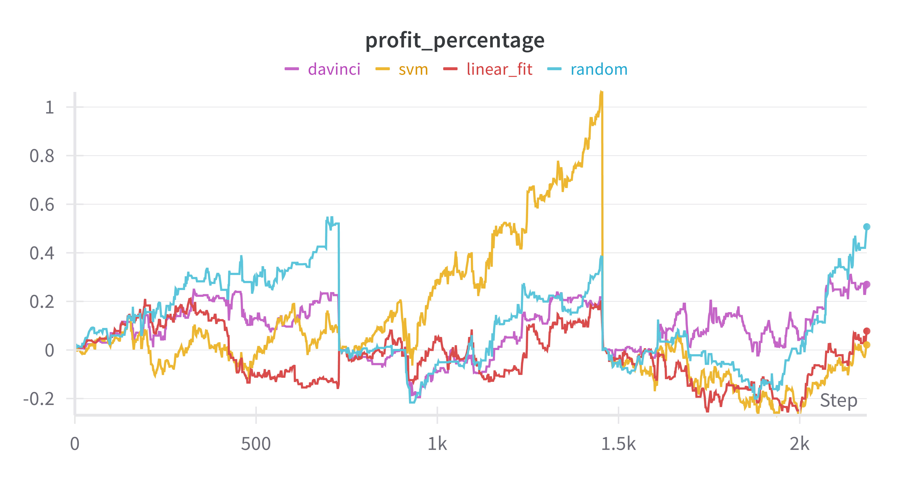
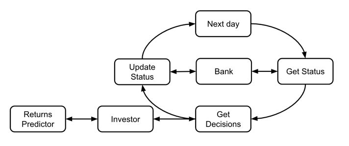
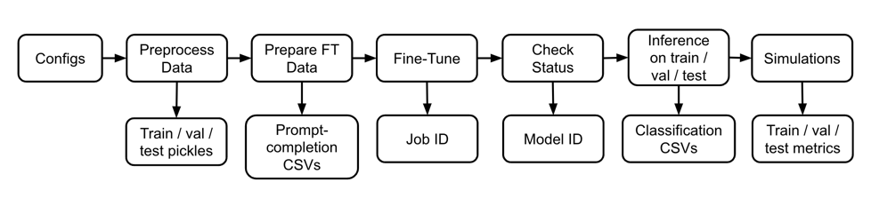

# InvestAI

This repository serves as an experimental framework for predicting stock returns using large language models (LLMs).
The framework is composed of three main modules: return predictors that forecast investment returns, an investor module
that makes decisions based on these predictions, and a simulation environment that tests the investor's decisions against
real-world market changes.

After building it purely for fun in just 10 days, I initially tested a few baseline models against a basic form of
LLM-based return
predictor in the first experiment, serving as a proof of concept to demonstrate the system's functionality.
In these simulations, only a single stock was available for purchase to the investor.
To achieve
significant results, substantial additional work is required.

In the chart above, the x-axis is uniformly divided into train, validation, and test periods, while the y-axis represents
the profit percentage at each point in time.
See more results of the first experiment
[here](https://api.wandb.ai/links/ravidcohen1/a0qzfxse).

## Data Collection
The data consists of financial information retrieved using the yfinance API and news articles scraped from
TechCrunch. The biggest advantage of LLMs over humans is their ability to process vast
amounts of textual data quickly. Therefore, my bet for enhancing the value of this repository is to significantly scale up the scraping efforts
for both training and inference purposes. Currently, the scraping implementation is quite basic.
See [finance_store.py](invest_ai%2Fdata_collection%2Ffinance_store.py) and [news_store.py](invest_ai%2Fdata_collection%2Fnews_store.py)

The [DataPreprocessor](invest_ai%2Fdata_collection%2Fpreprocess.py) operates at the beginning of every experiment to
process data according to the specific configurations of the experiment. It is thorough and dynamically adjusts to
configuration changes, and is also designed to effectively handle scaling up the data size.

## Return Predictor

This module is the most crucial and intelligent component of the system. It uses historical data to predict stock
returns, such as the opening or closing prices of the next day, based on the specified configurations.
The [LLMReturnPredictor](invest_ai%2Freturn_predictor%2Fllm_predictor.py) provides predictions using both
numerical and textual inputs from previous days, including news headlines and financial data.
Currently, the output of the LLMReturnPredictor includes labels that categorize the future potential of investments.
The number of these labels is configurable.
The LLMReturnPredictor currently uses an older OpenAI API for fine-tuning, which needs upgrades and updates.

For more basic implementations of return predictors, see [baselines.py](invest_ai%2Freturn_predictor%2Fbaselines.py)

## Investor
The Investor module receives the status of the bank and stock portfolio and makes decisions—such as whether to buy or
sell—based on forecasts from the Return Predictor. The current implementation is basic; it makes decisions solely based
on the predictor’s latest prediction.
It automatically buy as much as possible for specified labels and sell everything for others,
allowing adjustments to the buying and selling labels.
Improving this module could provide significant value relatively easily,
and I consider it as the "lowest hanging fruit."

## Simulator

The [Simulator](invest_ai%2Fsimulation%2Fsimulator.py) class in `invest_ai` conducts stock trading simulations,
utilizing models for an investor and a bank to simulate daily trading activities. Upon initialization, the simulator
is configured with a `Bank` object to manage transactions, an `AbstractInvestor` object for making trading decisions,
and a monthly budget that can be deposited into the bank account. The simulation progresses by evaluating daily
trading conditions, making buy or sell decisions based on the investor model's recommendations, and updating the
bank's status accordingly. At the end of the simulation, it provides a comprehensive trading history,
offering insights into the transactional dynamics and financial outcomes achieved during the simulation period.

The [Bank](invest_ai%2Fsimulation%2Fbank.py) class manages financial transactions and stock portfolios,
interfacing with the [FinanceStore](invest_ai%2Fdata_collection%2Ffinance_store.py) to access stock prices.
It handles buying and selling actions, daily financial updates, and manages fund deposits and transaction histories.

## Configurations

The experiment configuration controls all essential settings of the trading system,
including which stocks are available for trading, training and testing
periods, trading budget, the specific investor and predictor models tested, and the features used for return prediction.
This comprehensive setup allows precise adjustments to optimize the system's performance across various scenarios.

The configuration determines how the predicted targets are calculated by comparing stock prices at the purchase time
(buying_at) with
those at a later date specified by the selling_at parameter. Both can be set to values like open, close, adjusted close,
high, or low. The horizon setting defines the number of days between purchase and sale, and can be set to any number
of days.

The configuration of the bank sets the initial trading budget and monthly budget, as well as specifying the
buying_at and selling_at parameters, which align with the metrics used in target calculations.

Feature configuration determines the lookback period for historical data and defines textual and numerical features for
model input. It also includes strategies for scaling numerical features, handling missing values, and categorizing the
target into labels such as 'good', 'bad', or 'neutral'.

## Driver
The [driver.py](invest_ai/driver.py) file serves as the main entry point of this repository.
It instantiates the investor and the predictor, trains the predictor, runs the simulation,
and plots metrics for the train, validation, and test periods. These metrics include the total
value at each point in time (cash + stocks) of the investor, total profit (value minus the cumulative
budget at each point), and the percentage of profit.

## Further Work

The next steps should include updating [fine_tuning.py](invest_ai%2Ffine_tune%2Ffine_tuning.py)
to accommodate the new OpenAI API. Following that, enhancing
[prediction_based_investor.py](invest_ai%2Finvestor%2Fprediction_based_investor.py)
with a more sophisticated decision-making policy could potentially improve the performance
of the LLM-based model. These updates alone might enable the model to surpass baseline models.
From that point, adding more data is expected to further improve the model's performance.
Additionally, considering the replacement of the LLM with a text encoder that predicts numerical
targets directly, without the need for binning, should be explored.
